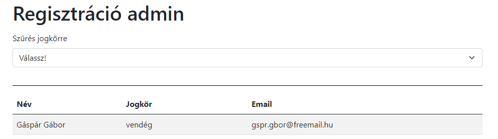
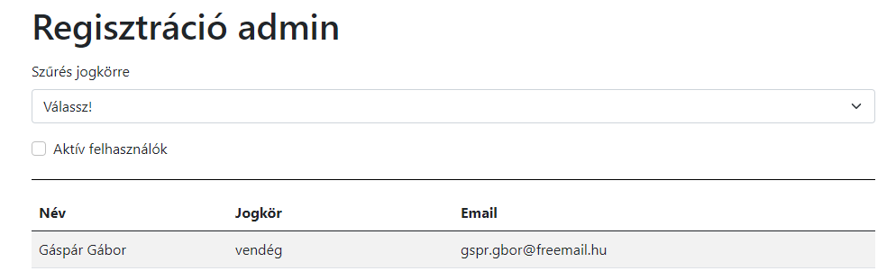
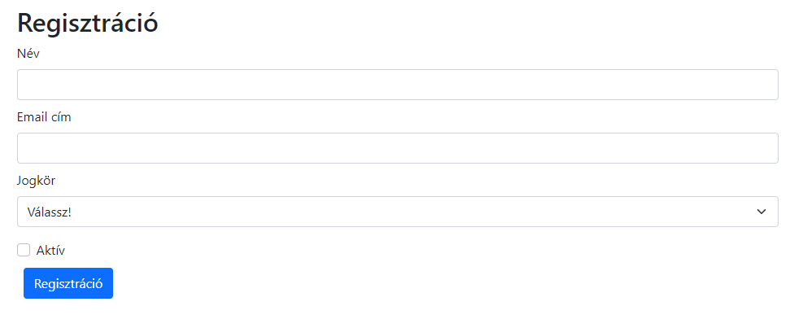
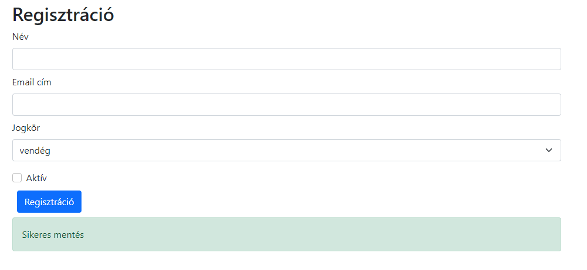
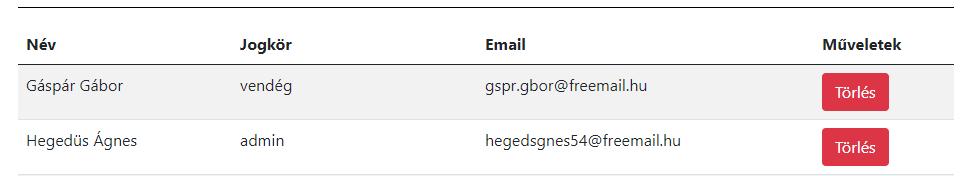

# HSG Frontend Képesítő vizsga

## Kezdeti lépések

- Fork-old ezt a repository-t a saját account-odra
- Klónozd a fork-olt repository-t a saját számítógépedre
- Készíts egy `.gitignore` file-t, hogy a generált file-ok ne szerepeljenek
  a commit-odban
- Commit-olj gyakran és az üzenetek legyenek elég deskriptívek
- Minden válasz és megoldás kerüljön ebbe a repository-ba

## Tartsd észben

- Bármilyen online forrást használhatsz, de **kérlek dolgozz egyedül!**
- **Ne csak copy-paste-eld** a válaszokat és megoldásokat,
  inkább használd a saját szavaidat
- **Ne push-olj** GitHub-ra, amíg a mentorod be nem jelenti, hogy eljött az idő
- Az utolsó fél órában feltöltheted a megoldásod a
  [GradeScope-ba](https://www.gradescope.com/courses/199686/assignments/1215230) zippelt (tömörített) formában
  - **Figyelj arra, hogy a feladatokat a megfelelő helyre kell feltölteni.**
- Az eredményednek legalább 51%-nak kell lennie, hogy sikeres legyen a vizsga

# Regisztráció admin

Egy regisztrációs rendszer admin felületét fejlesztjük tovább.

## Általános követelmények

- Fork-old ezt a repository-t a saját account-odra
- Klónozd a fork-olt repository-t a saját számítógépedre
- Commit-olj gyakran és az üzenetek legyenek elég deskriptívek
- Minden válasz és megoldás kerüljön ebbe a repository-ba
- Pusholni csak a vizsga lejárta előtt 10 perccel szabad

- A kiindulókódban megtalálható a regisztráltak táblázata, ezt kell
kiegészíteni 5 új funkcióval és hatodik feladatként hostolni a Firebase
 szolgáltatónál.
- Az adatkezléshez a Firestore online NoSQL adatbáziskezelőt kell használni.
- Megjelenésben a Bootstrap 5 CSS keretrendszer használandó SCSS stílussal
- Használható npm packagek: bootstrap@next, bootstrap-icons, firebase, react,
 react-dom, react-router-dom, react-scripts, node-sass, sass, validator,
 web-vitals
- A feladatoknak egymástól függetlenül lesznek tesztelve,
  így a feladatok egymásra gyakorolt hatásukkal nem kell számolni
  
## Feladat beküldése: Gradescope

- [Ezen a linken küldheted GradeScope-ba](https://www.gradescope.com/courses/199686/assignments/1215230)
  zippelt (tömörített) formában
- Gradescope-ra a `registrations` mappa tartalma legyen feltöltve. A `node_modules` és a `build`
  mappa tartalma nem kerülhet bele a zippel tömörített fájlba
- legyen `App.js` fájlod
- ne használj `.jsx` kiterjesztést
- a `firebase/app` helyett a `firebase` package legyen használva
- stíluslapok csak SCSS-ben legyenek
- a Gradescope-ban csak alap npm packagek vannak telepítve, így más npm package-t ezeken kívül nem tudtok használni
- használható npm packagek: `bootstrap@next`, `bootstrap-icons`,
  `firebase`, `react`, `react-dom`, `react-router-dom`, `react-scripts`, `node-sass`, `sass`, `validator`, `web-vitals`
- useState setter függvényei **csak valódi szükség esetén** legyenek anonymus függvénnyel és previous paraméterrel használva- A GradeScope-on feltöltést követően látható pontozás jelzés értékű,
  nem ezek lesznek a végleges pontok
- A GradeScope pontban 13:00-kor zár, nincs késedelemes leadás.

## Tesztek futtatása

Ez a repository tartalmaz egy kiinduló React projectet, amelynek a `__tests__` mappájában találsz teszteket, amelyekkel futtatásával előzetesen elenőrizheted a munkádat. 

- A tesztek a`__tests__` mappában vannak, a tesztesetek helyesek, nem kell új tesztet írni, és nem kell a meglévőket módosítani
- A tesztek nem fognak lefutni, amíg a megfelelő komponensek el nem készülnek
## Adatbázis beállítása

Adatbázishoz használj Firestore-t:

- Engedélyezd az `anonymous` beléptetést az `Authentication` menüpont alatt.
- Hozz létre egy adatbázist Firestore alatt
- A `registrations/src/firebase/config.example.js` file alapján készíts
  ugyanabban a könyvtárban egy `config.js`
  file-t, a projektedhez tartozó beállításokat használd.
- Készíts egy `qualification-exam` collection-t Firestore-ban
- Állítsd be Firestore-ban az írási és olvasási engedélyt/szabályt
- (Opcionális) példa adatok feltöltéséhez futtasd a `registrations`
  könyvtárban állva a `yarn run loadData` utasítást.

## Feladatsor főbb pontjai

1. feladat: Szűrés jogkörre (20 pont)
1. feladat: Szűrés aktív felhasználókra (20 pont)
1. feladat: Statisztika táblázat készítése (15 pont)
1. feladat: Új felhasználó létrehozása (15 pont)
1. feladat: Törlés funkció (15 pont)
1. feladat: Weboldal hosztolása (15 pont)

## 1. feladat: Szűrés jogkörre

Egy legördülő lista alapján szűrd le és frissítsd az adott táblázat tartalmát

  - Készíts egy legördülő selectet "Szűrés jogkörre" címkével.
  - A `<select>` érték készlete: "Válassz!", "admin", "vendég", "regisztrált
  felhasználó" legyen
  - A "Válassz!" opció legyen alapértelmezetten kiválasztva és ebben az esetben
  az összes adatot mutassa
  - Firebase-ből a kiválasztott opciónak megfelelően legyenek az adatok lekérve
  - A táblázat értékei a `<select>`-ben kiválasztott értéknek megfelelően mutassa
  az adatokat a Firestore adatbázisból
  - Használj Bootstrap osztályokat

## 2. feladat: Szűrés aktív felhasználókra

Egy checkbox segítségével szűrd le és frissítsd a táblázat tartalmát

  - A checkbox címkéje 'Aktív felhasználók' legyen
  - Ha a checkbox ki van választva, akkor csak az aktív felhasználókat mutassa a
    táblázat
  - Ha a checkbox üres, akkor az aktívak és a nem aktívak is látszódjanak a
  táblázatban
  - Firebase-ből vegye a táblázat az adatait
  - Használj Bootstrap osztályokat

## 3. feladat: Statisztika táblázat készítése

- A táblázat alatt szerepeljen egy statisztika táblázatban, hogy összesen és
  jogkörönként hány felhasználó van az adatbázisban
- az első oszlop a jogköröket tartalmazza, a második oszlop pedig az értékeket
- az utolsó sorban legyen az összegzés
- az adatok kiszámolásához JavaScript kódot használj (ne adatbázis aggregáló
függvényt)
- ehhez hasonlóan:

## 4. feladat: Új felhasználó létrehozása

- Legyen egy "Új felhasználó" gomb a főoldali táblázat felett
- Az "új felhasználó" gomb a '/users/new' oldalra navigáljon oldalújratöltés nélkül
- Az űrlap tetején jelenjen meg a következő 1-es címsorba tartozó felirat: "Regisztráció"
- Legyen egy űrlap a következő beviteli mezőkkel, és hozzájuk tartozó `<label>`
elemmel:
  - 'Név', text típus, 'fullName' legyen az azonosítója
  - 'Email cím',  email típus, 'email' legyen az azonosítója
  - 'Jogkör', `<select>` típusú, választható értékei:
    'Válassz!', 'admin', 'vendég', 'regisztrált felhasználó'
  - 'Aktív' feliratú checkbox
  - 'Regisztráció' gomb, amit megnyomva felviszi az új felhasználót

- 'Név' validációs szabályok lefejlesztése és alkalmazása:
  - A név kötelezően kitöltendő, hibaüzenet: 'Kitöltése kötelező'
- 'Email cím' validációs szabályok lefejlesztése és alkalmazása:
  - Az email cím kötelezően kitöltendő, hibaüzenet: 'Kitöltése kötelező'
  - Az email cím feleljen meg az email formátumának, hibaüzenet: 'Nem megfelelő
  email cím formátum'
- 'Jogkör' validációs szabályok lefejlesztése és alkalmazása:
  - A jogkör kötelezően választandó, csak a következő értékek elfogadhatóan:
  'admin', 'vendég', 'regisztrált felhasználó'.
  - Validációs Hibaüzenet: 'Választani kötelező'
- Ha a form valid, akkor regisztráció gomb megnyomására menti Firestore adatbázisba
  az adatokat.
- Sikeres mentés esetén Bootstrap sikeres alert üzenet megjelenítése a form
  alatt: sikeres mentés
- Sikeres mentés esetén a form mezői legyenek kiürítve

## 5. feladat: Törlés funkció

- Hozz létre a táblázatban egy új oszlopot 'Műveletek' fejléccel
- A táblázat minden sorába kerüljön a 'Műveletek' oszlopban egy Bootstrap
  osztályt használó piros törlés gomb
- A törlés gomb megnyomására a gombhoz tartozó dokumentum legyen törölve az
  adatbázisból
- A törlés gomb megnyomására a gombhoz tartozó sor legyen törölve a táblázatból

## 6. feladat: Weboldal hosztolása

- Buildeld le a munkádat
- Deployold Firebase hosting szolgáltatónál
- a repositoryban található [registrations/public-link.txt](registrations/public-link.txt)
  fájlba írd bele a hosting linkjét, pl.: http://valami-nev-23231dd9.web.app
